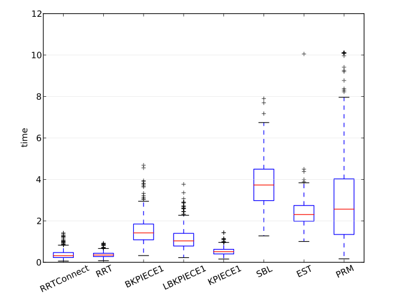

# 记录ompl的学习过程

## 常用到的状态空间类型

- ob::RealVectorStateSpace: 最基础的线性空间, 表示单纯的连续的线性量，如关节角度，XYZ位置，速度，加速度等。
- ob::SO2StateSpace、ob::SO3StateSpace：用于处理旋转，分别表示2维和3维
- ob::SE2StateSpace、ob::SE3StateSpace：表示刚体位置和旋转的组合
- ob::CompoundStateSpace: 符合状态空间，当标准空间不够用的时候，可以将上述状态空间组合得到一个更为复杂的系统。


设置刚体在3维中的运动：

- 设置状态空间，例如SE(3)
- 定义状态空间的边界范围
- 定义状态的有效性检测器
- 定义起始状态和结束状态

```cpp
namespace ob = ompl::base;
namespace og = ompl::geometric;
// ob::StateSpacePtr 状态空间的智能指针
auto space(std::make_shared<ob::SE3StateSpace>());
ob::RealVectorBounds bounds(3);
bounds.setLow(-1);
bounds.setHigh(1);
space->setBounds(bounds);   // 设置状态边界范围

// SimpleSetup包含SpaceInformation和ProblemDefinition
og::SimpleSetup ss(space);

// 空间信息部分即状态有效性检测 spaceInformation
ss.setStateValidityChecker([](const ob::State *state){return isStateValid(state)};);

// 问题定义即起始结束状态 ProblemDefinition
ob::ScopedState<> start(space);
start.random();
ob::ScopedState<> goal(space);
goal.random();
ss.setStartAndGoalStates(start, goal);

// 设置规划器planner 或 使用默认规划器
// 返回是否在规定时间内完成规划
ob::PlannerStatus solved = ss.solve(1.0); 

if (solved)
{
    std::cout << "Found solution" << endl;
    ss.simplifySolution();
    ss.getSolutionPath().print(std::cout);
}
```

因为对于不同的问题，往往状态的定义是不同的，因此有效的状态标准也是不同的，因此都需要我们自己去定义有效状态检测器(`ompl::base::StateValidityChecker`、`ompl::base::MotionValidator`)

**StateValidityChecker**用来判断某一个单独的状态是否有效，（默认使用AllValidStateValidityChecker认为所有状态都有效）
**MotionValidator**主要借助于类中的checkMotion() 函数，来判断连接两个状态之间的路径是否有效。（默认实现是DiscreteMotionValidator，离散运动验证器，将路径切分成许多小段，然后调用StateValidityChecker 逐个检查这些点）

检测器的实现主要分为类实现和函数实现两种：

```cpp
class myStateValidityCheckerClass : public base::StateValidityChecker   // 继承父类
{
public:
     myStateValidityCheckerClass(const base::SpaceInformationPtr &si) :
       base::StateValidityChecker(si)   // 父类初始化
    {       // 初始化实现
    }
    // 检测器实现
    virtual bool isValid(const base::State *state) const
    {
            return ...;
    }
};

bool myStateValidityCheckerFunction(const base::State *state)
{
     return ...;
}

base::SpaceInformationPtr si(space);
// either this call: 类实现声明
si->setStateValidityChecker(std::make_shared<myStateValidityCheckerClass>(si));
// or this call: 函数实现声明
si->setStateValidityChecker(myStateValidityCheckerFunction);
si->setStateValidityCheckingResolution(0.03); // 3%
si->setup();
```

MotionValidator实现
```cpp
// 定义此类：
class myMotionValidator : public base::MotionValidator
{
public：
    // 实现 checkMotion()
};
 
base::SpaceInformationPtr si(space);
si->setMotionValidator(std::make_shared<myMotionValidator>(si));
si->setup();
```

## 操作状态和状态空间

### 分配内存

创建每一个状态变量，必须通过特定的方式来分配内存。对于分配内存，推荐使用其中提供的智能指针
底层实现是使用抽象基类创建状态，需要手动分配释放内存，操作容易造成内存泄露。可以使用ompl提供的ScopedState类来自动处理内存的分配和释放。

```cpp
ompl::base::SpaceInformationPtr si(space);
ompl::base::State* state = si->allocState(); // 手动分配
...
si->freeState(state); // 必须手动释放！

// 利用ScopedState自动管理
// 方法 A: 使用状态空间指针
ompl::base::StateSpacePtr space(new T());
ompl::base::ScopedState<> state(space);

// 方法 B: 使用空间信息指针
ompl::base::SpaceInformationPtr si(space);
ompl::base::ScopedState<T> state(si);
```

### 设置状态

主要通过ScopedState实例化的对象对状态值进行设置

```cpp
// 1. 定义一个 SE(2) 状态空间（x, y, 角度）
ompl::base::StateSpacePtr space(new ompl::base::SE2StateSpace());

// 2. 创建一个“作用域状态” (ScopedState)
// 注意：这里指定了具体的类型 <ompl::base::SE2StateSpace>
ompl::base::ScopedState<ompl::base::SE2StateSpace> state(space);

// 3. 直接设置值（因为指定了类型，所以能用 setX, setY 等专用函数）
state->setX(0.1);
state->setY(0.2);
state->setYaw(0.0);

// 4. 打印状态
std::cout << state;

ompl::base::ScopedState<> backup = state;// 赋值一份状态
state = backup; // 还原数据
```

```cpp
// 创建一个复合空间：SO(2) [旋转] + SO(3) [3D旋转]
ompl::base::CompoundStateSpace *cs = new ompl::base::CompoundStateSpace();
cs->addSubspace(ompl::base::StateSpacePtr(new ompl::base::SO2StateSpace()), 1.0);
cs->addSubspace(ompl::base::StateSpacePtr(new ompl::base::SO3StateSpace()), 1.0);

ompl::base::StateSpacePtr space(cs);
ompl::base::ScopedState<ompl::base::CompoundStateSpace> state(space);

// 访问第 0 个子空间（SO2），并将其强制转换为正确的类型来设置值
state->as<ompl::base::SO2StateSpace::StateType>(0)->setX(5.0);
state->as<ompl::base::SO3StateSpace::StateType>(1)->setX(5.0);
```

解释 `as<T>()`： 这是 OMPL 的“翻译官”。因为 state 在底层只是一块通用的内存，编译器不知道它也是一个 SE2 状态。`as<SE2...>()` 就是告诉编译器：“把这块内存当做 SE2 来看待”，这样你才能访问 setX 等函数。

```cpp
namespace ob = ompl::base;
ob::StateSpacePtr so2(new ob::SO2StateSpace());
ob::StateSpacePtr rel2(new ob::RealVectorStateSpace(2));

// 利用+ 进行组合 注意顺序很重要 影响索引
ob::StateSpacePtr space = so2 + rel2;

// 依照状态空间 设置一个状态值 状态值随机
ob::ScopedState<ob::CompoundStateSpace> fullState(space);
fullState.random();

// 提取复合状态空间中的一个子空间 来设置一个状态值
ob::ScopedState<> pos(space->as<ob::CompoundStateSpace>()->getSubspace(0)); // 一个只含有so2信息的状态

pos << fullState;   // 只进行角度信息的转移
fullState >> pos;
pos >> fullState;
```

## 采样器的实现

基于采样的运动规划中，规划期的核心动作就是采样，即随机找一个点，该动作的实现依赖于采样器来完成。那么采样器主要分为以下两种：

- ob::StateSampler(基础状态采样器)，最底层的数学生成器，只管根据坐标范围生成随机数
- ob::ValidStateSampler(有效状态采样器)，会对基础状态采样器采样的随机数进行过滤，让采样器循环采样直到采样到有效状态。同时也会有高级功能，让采样器有策略的采样。

OMPL内置了几个有效状态采样器：

1. **UniformValidStateSampler**: 最简单的策略，也是默认的采样器，不停的随机采样，直到采样到一个无碰撞的位置。适用于简单开阔的环境。
2. **ObstacleBasedValidStateSampler**：基于障碍物进行采样，例如会先找到一个有效点和一个无效点，然后在他们之间进行插值，试图找到一个紧贴着障碍物边缘的有效点。适合于狭窄通道和受限的环境。
3. **GaussianValidStateSampler**：基于高斯\正态分布，先找到一个点，然后以此为中心用高斯分布在附近找到第二个点，保留有效的点。同样适合于窄通道和受限的环境。
4. **MaximizeClearance...Sampler**：最大化间隙。它不仅要找无碰撞的点，还试图找离障碍物最远的点。适合于需要高安全性的场景。

### 调用现有的采样器

采样器不能简单的拷贝，因为采样器必须保证是线程安全的，每个线程需要一份独立的拷贝（深拷贝）。因此我们需要写一个分配器函数，来对采样器在内存中单独创建，返回对应的地址。

```cpp
namespace ob = ompl::base;

// 1. 定义一个分配器函数
// 这个函数的作用是：当系统需要采样器时，创建一个 ObstacleBasedValidStateSampler 并返回对应地址
ob::ValidStateSamplerPtr allocOBValidStateSampler(const ob::SpaceInformation *si)
{
    return std::make_shared<ob::ObstacleBasedValidStateSampler>(si);
}

void plan()
{
    // ... (标准的 setup 代码) ...
    
    // 2. 告诉 SpaceInformation 使用你的分配器
    ss.getSpaceInformation()->setValidStateSamplerAllocator(allocOBValidStateSampler);
    
    // 3. 之后的 setup() 和 solve() 就会自动使用新采样器了
    ss.setup();
    ss.solve(1.0);
}
```

### 创建自定义采样器

```cpp
class MyValidStateSampler : public ob::ValidStateSampler
{
public:
    MyValidStateSampler(const ob::SpaceInformation *si) : ValidStateSampler(si)
    {
        name_ = "my_custom_sampler";
    }

    // 核心函数：生成一个有效样本
    bool sample(ob::State *state) override
    {
        // 1. 获取底层的随机数生成器
        // 2. 根据数学公式，直接生成一个合法的 x, y, z
        // 3. 赋值给 state
        
        double* val = state->as<ob::RealVectorStateSpace::StateType>()->values;
        
        // 假设我们的规则是：只有 Z > 0.5 的区域是安全的
        val[0] = rng_.uniformReal(-1, 1); // x
        val[1] = rng_.uniformReal(-1, 1); // y
        val[2] = rng_.uniformReal(0.5, 1); // z (直接生成有效范围)

        return true; // 告诉系统一定要生成成功
    }

    // 必须实现，但在某些规划器中可能用不到
    bool sampleNear(ob::State* state, const ob::State* near, const double distance) override
    {
        throw ompl::Exception("未实现 sampleNear");
        return false;
    }

protected:
    ompl::RNG rng_; // 随机数生成器
};
```

自定义采样器的调用和现有采样器的调用是一样的，都需要一个采样器创建函数在内存中创建一个所需的采样器，返回对应指针。

## 路径可视化

OMPL只负责纯数学计算，生成一系列的坐标点，不负责画图渲染，因此OMPL是轻量级的，可以嵌入到任何系统中。
那么想要实现可视化，可以通过以下操作：

- OMPL计算 -> 导出数据(文本文件\矩阵)
- 外部软件（python\Matlab\Excel） -> 读取数据 -> 画图

OMPL主要有两种路径：

- ompl::geometric::PathGeometric：几何路径（只包含状态点，一行一个状态）
- ompl::control::PathControl：控制路径（包含状态、控制指令和持续时间）

运行你的程序，并将输出重定向到一个文件，例如 path.txt
`./my_ompl_program > path.txt`

```cpp
// 假设 ss 是你的 SimpleSetup 对象
bool solved = ss.solve(20.0);

if (solved)
{
    // 方法 1: 如果是几何规划 (Geometric)
    // getSolutionPath() 返回 PathGeometric 对象
    // printAsMatrix() 默认输出到屏幕，这里我们重定向到 std::cout
    ss.getSolutionPath().printAsMatrix(std::cout);

    // 方法 2: 如果是控制规划 (Control)
    // 通常我们先把控制路径转换为几何路径（自动插值），再打印
    ss.getSolutionPath().asGeometric().printAsMatrix(std::cout);
}
```

其中printAsMatrix函数的作用就是将整条路径的所有状态点，以“矩阵”的形式打印出来。

- 行 (Row)：矩阵的每一行代表路径上的一个状态点 (State)。如果路径有 100 个点，就会打印 100 行。
- 列 (Column)：矩阵的每一列代表状态的一个数值分量。

因此常见的用法有：
打印到屏幕上，`path.printAsMatrix(std::cout);`
保存到文件中，

```cpp
std::ofstream myfile("path.txt");  // 创建文件
path.printAsMatrix(myfile);        // 写入文件
myfile.close();                    // 关闭文件
```

Q1：为什么路径点很少，连不成线？ OMPL 规划出的路径通常只包含“关键转折点”。需要对路径进行插值 (Interpolate)`ss.getSolutionPath().interpolate(); // 增加中间点，使路径变平滑`

Q2: 控制路径 (PathControl) 为什么要转成几何路径？PathControl 的原始数据包含的是“向左转 3 秒，油门 50%”这样的指令，很难直接画出来。asGeometric() 会自动根据这些指令模拟出机器人的轨迹坐标，方便画图。

## 基准测试

OMPL 包含一个 ompl::Benchmark 类，它能够方便地使用不同的参数、不同的规划器、不同的采样器，甚至同一算法的不同配置版本，重复解决同一个运动规划问题。

OMPL.app 包含一个名为 ompl_benchmark 的命令行程序。它可以读取一个基于文本的配置文件（ini 风格格式，使用键/值对）。

```c
[problem]
name=my_benchmark_problem
robot=my_robot_mesh.dae
start.x=0.0
start.y=0.0
start.theta=0.0
goal.x=1.0
goal.y=1.0
goal.theta=0.0

[benchmark]
time_limit=10.0
mem_limit=1000.0
run_count=3

[planner]
est=
rrt=
```

配置文件主要分为三个部分：[problem]、[benchmark]、[planner]

首先介绍**problem**：

- name：问题标识名称
- robot：描述机器人几何形状的网格文件路径
- start.[x|y|z|theta]：机器人的起始状态
- goal.[x|y|z|theta]：机器人的目标状态
- world: 描述环境几何形状的网格文件路径。如果不指定，则假设是在空旷空间中。
- objective：最小化路径长度、最大化路径上的最小间隙
- objective.threshold: 优化阈值
- control: 动力学系统类型
- sampler: 采样器类型，默认uniform

基准测试参数**benchmark**：

- time_limit: 每次规划计算的时间限制（秒）
- mem_limit: 每个规划器的最大内存（MB）
- run_count: 每个规划器重复实验的次数（例如 50 次）
- output: 日志文件保存目录
- save_paths: 是否保存路径

选择规划器**planner**：

几何规划器：kpiece, bkpiece, lbkpiece, est, sbl, prm, lazyprm, rrt, rrtconnect, rrtstar, fmt, pdst, stride 等。
动力学规划器: kpiece, rrt, est, pdst, sycloprrt 等。

同时可以设置规划期名称、步长、目标偏向

### 基准结果

跑完程序后，你会得到一个 benchmark.log 文件。这个文件是纯文本，人类很难直接看懂。OMPL 提供了工具把它变成漂亮的图表。
处理方法有：通过网站上传log文件、使用py脚本

```cpp
# 1. 把 log 转成数据库 (.db)
python ompl/scripts/ompl_benchmark_statistics.py benchmark.log -d mydatabase.db

# 2. 把数据库画成 PDF
python ompl/scripts/ompl_benchmark_statistics.py -d mydatabase.db -p boxplot.pdf
```



OMPL 的基准测试工具（ompl_benchmark_statistics.py）默认生成的图表是箱线图。这是一张统计学图表，能一眼看出算法的“速度”和“稳定性”。
Y 轴是 Time (s)（时间），X 轴是不同的 Planners（规划器）

**箱子 Box**
中间的横线：中位数 (Median)。这是最重要的指标。它表示在 50% 的测试中，该算法的耗时都小于这个值。中位数越低，说明算法通常越快。
箱子的上下边缘：分别代表 75% 分位数和 25% 分位数。
箱子的高度：代表数据的集中程度。箱子越扁，说明算法表现越稳定；箱子很高，说明算法有时候很快，有时候很慢，方差大。

**胡须 Whiskers**
从箱子上下延伸出去的线（通常带有横杠），代表了数据的有效范围（通常是 1.5 倍的四分位距）。绝大多数正常的运行结果都在这个范围内。

**离群点 Outliers**
那些在胡须之外的独立小圆点或十字。代表在某次测试中，算法“发挥失常”（例如陷入了死胡同，花了特别长的时间）。离群点太多意味着算法不可靠。

## 优化规划

### 最优规划

在普通的运动规划中，我们只关心能否找到一条从起点到终点的无碰撞路径。这就像是用地图找路，只要能通就行，哪怕绕了远路。

但是对于实际问题，这还不够，我们还需要：

- 最短路径
- 离障碍物最远路径
- 机械功最小的路径

这就是最优规划：寻找一条既满足约束（无碰撞），又能使某个指标（Path Quality Metric）最优化的路径。

那么实现最优规划的两大要素就是：

1. 优化目标，即我们要求优化的量，告诉计算机什么是好
2. 优化规划器，算法不仅能找到路还能不断改进这条路，直到找到理论上的最优解

OMPL 内置了几种常用的“评判标准”，指定了优化对象的类：

**ob::OptimizationObjective** 是所有**优化目标的基类**（父类），定义了什么是好什么是坏。关键的方法为**stateCost(state)**, 计算停在某点(状态)的成本。**motionCost(s1, s2)**，计算从点s1到点s2的成本。**isSatisfied(cost)**，判断当前成本是否已经达到及格线了。

**ob::PathLengthOptimizationObjective** 是ob::OptimizationObjective的一个子类，他把**成本定义为直线距离**。$$Cost = \sum \text{distance}(p_i, p_{i+1})$$

**ob::StateCostIntegralObjective** 是 OMPL 中用于定义“基于状态成本的路径积分”优化目标的一个类。它是 ompl::base::OptimizationObjective 的子类。计算的是路径上所有点成本的积分 $$\text{PathCost} = \int_{\text{path}} \text{cost}(s) \, ds$$

**maximizeMinClearanceObjective** 让路径尽可能远离障碍物，适合需要高安全性的机器人。倾向于“走大路中间”。它的目标是寻找一条路径，**使得路径上离障碍物最近的那个点，距离障碍物也尽可能远**。$$\sigma^* = \operatorname*{arg\,max}_{\sigma} \left( \min_{x \in \sigma} c(x) \right)$$

**ob::MechanicalWorkOptimizationObjective** 考虑力和距离的乘积，适合动力学系统。$$J(\pi) = \int_{0}^{T} \|u(t)\| \, dt$$ $$Cost = \sum_{i=1}^{N} (t_i \cdot \|u_i\|)$$

**ob::StateCost** 是一个简单的包装类，用于存储一个数值（成本值），可以是单个值也可以是一个向量。

可以实现多目标优化，例如把多个代价加权求和`Cost = 0.8 * 长度 + 0.2 * 安全性`

常需要修改的方法有：

- stateCost() ：给每一个state定义cost
- combineCosts() : 定义如何把多段(motions\states)的costs组合起来。
- isCostBetterThan() : 告诉planner如何比较的最优的，例如是最大化还是最小化
- identityCost() / infiniteCost() ：定义单位代价和无穷代价，通常对于最小化目标来说identity是0，infinite是正无穷。

### 优化规划器

并不是所有的规划器都支持优化。普通的 RRT 找到一条路就停止了，它不会关心这条路是不是绕远了。需要使用渐近最优 (Asymptotically Optimal) 的规划器。这意味着只要给它足够的时间，它找到的路径就会无限逼近真正的最优解。

常见的优化规划器：

- RRT* (RRTStar)：RRT 的改进版，这是最著名的优化算法。
- PRM* (PRMStar)：PRM 的改进版。
- TRRT (Transition-based RRT)：基于过渡的 RRT，适合寻找低成本路径。
- FMT* (Fast Marching Tree)：快速行进树算法。

注意：OMPL 还支持 CForest 并行框架，可以让多个规划器同时跑，谁找到更好的路就共享给别人，极大地加速收敛。

### 指定最优性阈值

最短路径指的是长度（代价）小于某一给定值的路径，当规划出来的路径小于该阈值的时候，规划器会停止规划。当我们没有设置该阈值的时候，默认阈值为0，也就是只有长度(代价)小于0的时候才会停止规划。这当然是不可能的，因此该条件永远不会满足，会让规划器运行到指定时间限制并返回他能找到的最佳路径。
`obj->setCostThreshold(ob::Cost(1.5));` 设置阈值
`auto obj =  std::make_shared<ob::PathLengthOptimizationObjective>(si);`  优化规划器内存申请
`pdef->setOptimizationObjective(obj);` 设置

```cpp
#define _CRT_SECURE_NO_WARNINGS
/*********************************************************************
 * OMPL Optimal Planning Demo
 * * 功能：
 * 1. 定义一个 2D 规划环境。
 * 2. 演示如何使用 RRT* (RRTStar) 进行路径长度优化。
 * 3. [高级] 演示如何自定义优化目标（危险区域成本），让机器人绕开高风险区。
 *********************************************************************/

#include <ompl/base/SpaceInformation.h>
#include <ompl/base/spaces/RealVectorStateSpace.h>
#include <ompl/base/objectives/PathLengthOptimizationObjective.h>
#include <ompl/base/objectives/StateCostIntegralObjective.h>
#include <ompl/geometric/planners/rrt/RRTstar.h>
#include <ompl/geometric/SimpleSetup.h>
#include <ompl/config.h>
#include <iostream>
#include <fstream>

namespace ob = ompl::base;
namespace og = ompl::geometric;

// 定义圆形障碍物：圆心 (0.5, 0.5)，半径 0.25
bool isStateValid(const ob::State* state)
{
    const auto* pos = state->as<ob::RealVectorStateSpace::StateType>();
    double x = pos->values[0];
    double y = pos->values[1];

    // 计算到圆心 (0.5, 0.5) 的距离
    double dist = sqrt(pow(x - 0.5, 2) + pow(y - 0.5, 2));

    // 如果距离小于半径，说明撞到了 (无效)
    return dist > 0.25;
}

// --- 高级：自定义优化目标 ---
// 假设 (0.5, 0.8) 附近有一个"危险区" (虽然没有障碍物，但走这里成本很高)
// 我们希望机器人避开这个区域
class DangerZoneObjective : public ob::StateCostIntegralObjective
{
public:
    DangerZoneObjective(const ob::SpaceInformationPtr& si) :
        ob::StateCostIntegralObjective(si, true)
        // true 启用运动成本插值，计算路径加权成本
        // false 只看终点起点的代价值
    {
    }

    // 定义每个状态点的成本
    ob::Cost stateCost(const ob::State* s) const override
    {
        const auto* pos = s->as<ob::RealVectorStateSpace::StateType>();
        double x = pos->values[0];
        double y = pos->values[1];

        // 危险区圆心 (0.5, 0.8)
        double dist = sqrt(pow(x - 0.5, 2) + pow(y - 0.8, 2));

        // 如果在危险区附近 (距离小于 0.2)，成本非常高
        if (dist < 0.2)
            return ob::Cost(10.0); // 高成本

        return ob::Cost(1.0); // 正常成本
    }
};

void planWithObjective(const ob::SpaceInformationPtr& si, ob::ProblemDefinitionPtr& pdef, bool useCustomObjective)
{
    // 1. 设置优化目标
    if (useCustomObjective)
    {
        // 使用我们自定义的“危险区”目标
        // 这会让机器人尽量绕开 (0.5, 0.8)
        auto obj = std::make_shared<DangerZoneObjective>(si);
        pdef->setOptimizationObjective(obj);
        std::cout << "Using Custom Danger Zone Objective." << std::endl;
    }
    else
    {
        // 使用默认的“最短路径”目标
        auto obj = std::make_shared<ob::PathLengthOptimizationObjective>(si);
        // 设置一个阈值（可选）：如果找到长度小于 1.5 的路径，就认为足够好了，提前停止
        obj->setCostThreshold(ob::Cost(1.5));
        pdef->setOptimizationObjective(obj);
        std::cout << "Using Path Length Objective." << std::endl;
    }

    // 2. 创建优化规划器 RRT*
    auto planner = std::make_shared<og::RRTstar>(si);
    planner->setProblemDefinition(pdef);
    planner->setup();

    // 3. 求解 (给它 1.0 秒的时间去优化)
    // 时间越长，RRT* 找到的路径越直、越短
    ob::PlannerStatus solved = planner->solve(ob::timedPlannerTerminationCondition(1.0));

    if (solved)
    {
        std::cout << "Found solution!" << std::endl;
        // 获取路径
        auto path = pdef->getSolutionPath()->as<og::PathGeometric>();

        // 打印路径成本
        std::cout << "Path Cost: " << path->cost(pdef->getOptimizationObjective()).value() << std::endl;

        // 简单的控制台可视化 (打印关键点坐标)
        // path->printAsMatrix(std::cout); 
    }
    else
    {
        std::cout << "No solution found." << std::endl;
    }
}

int main()
{
    // 1. 创建状态空间 [0, 1] x [0, 1]
    auto space = std::make_shared<ob::RealVectorStateSpace>(2);
    space->setBounds(0.0, 1.0);

    // 2. 空间信息
    auto si = std::make_shared<ob::SpaceInformation>(space);
    si->setStateValidityChecker(isStateValid);
    si->setup();

    // 3. 定义起点和终点
    ob::ScopedState<ob::RealVectorStateSpace> start(space);
    start->values[0] = 0.1; start->values[1] = 0.1;
    ob::ScopedState<ob::RealVectorStateSpace> goal(space);
    goal->values[0] = 0.9; goal->values[1] = 0.9;

    // 4. 定义问题
    auto pdef = std::make_shared<ob::ProblemDefinition>(si);
    pdef->setStartAndGoalStates(start, goal);

    // --- 运行两次对比 ---

    std::cout << "--- Run 1: Shortest Path ---" << std::endl;
    // 第一次：只找最短路 (false)
    planWithObjective(si, pdef, false);

    // 清除上一次的解，准备第二次运行
    pdef->clearSolutionPaths();

    std::cout << "\n--- Run 2: Avoid Danger Zone ---" << std::endl;
    // 第二次：找避开危险区的路 (true)
    planWithObjective(si, pdef, true);

    return 0;
}
```

### 多目标优化（Multiobjective Optimization）

有时候希望既要路短，又要安全。OMPL 提供了 `ompl::base::MultiOptimizationObjective` 来组合多个目标, 将多个目标加权求和, 有两种创建方式，一种是隐式创建，借助于运算符重载。另一种是显示创建借助于函数`addObjective(obj, weight)`

```cpp
ob::OptimizationObjectivePtr getBalancedObjective(const ob::SpaceInformationPtr& si)
{
    auto lengthObj = std::make_shared<ob::PathLengthOptimizationObjective>(si);
    auto clearObj  = std::make_shared<ClearanceObjective>(si);

    // 组合目标：10.0 * 长度成本 + 1.0 * 安全成本
    // 这意味着我们更看重路径长度（因为系数大），但在长度差不多的情况下选更安全的
    return 10.0 * lengthObj + clearObj;
}
```

```cpp
ob::OptimizationObjectivePtr getBalancedObjectiveExplicit(const ob::SpaceInformationPtr& si)
{
    auto lengthObj = std::make_shared<ob::PathLengthOptimizationObjective>(si);
    auto clearObj  = std::make_shared<ClearanceObjective>(si);

    // 1. 创建多目标容器 (注意：构造函数不接受 true/false 参数) MultiOptimizationObjectivePtr
    auto opt = std::make_shared<ob::MultiOptimizationObjective>(si);

    // 2. 添加目标并设置权重
    opt->addObjective(lengthObj, 10.0); // 权重 10.0
    opt->addObjective(clearObj, 1.0);   // 权重 1.0

    return opt;
}
```

### 启发式函数 Heuristics

为了让规划器更快，我们可以提供启发式函数

motionCostHeuristic(s1, s2)：快速估算两点间成本的下界。如，当我知道从A到B至少花费100，且目前存在80的路径的时候我们就会放弃探索A到B，从而节省时间。

```cpp
ob::Cost motionCostHeuristic(const ob::State *s1, const ob::State *s2) const override
{
    return ob::Cost(si_->distance(s1, s2));
}
```

## 受限规划

在普通的运动规划中，我们只需要避开障碍物（碰撞检测）。但在受限规划中，**机器人还必须遵守一些严格的数学约束**。

### 定义约束 (Constraint)

需要继承 ompl::base::Constraint 类，并实现两个关键函数：

- `function(x, out)`: 计算约束函数的值（偏差量）。如果 $out=0$，说明满足约束。
- `jacobian(x, out)` (可选但推荐): 计算约束函数的雅可比矩阵（导数）。有了它，规划器能更快地修正偏差。官方提供了一个 Python 脚本 `ConstraintGeneration.py`，可以用 SymPy 自动帮你生成 C++ 的雅可比矩阵代码。

### 定义受限状态空间(ConstrainedStateSpace)

普通的 RealVectorStateSpace 可以在空间里乱跑，但 ConstrainedStateSpace 会强迫所有的采样点都落在约束面上。

OMPL 提供了三种受限状态空间的实现：

1. `ProjectedStateSpace` (投影状态空间)--纠正者，会先在空间中随机采样一个点，然后会利用约束函数的梯度（雅可比矩阵），使用牛顿迭代法将这个点拉回到约束面上。
2. `AtlasStateSpace` (图谱状态空间)--绘图者，像画地图一样，用许多张局部的线性切平面拼接起来近似整个曲面。
3. `TangentBundleStateSpace` (切丛状态空间)--探路者，是一种懒惰 (Lazy) 的图谱法。它不维护全局地图，而是只关注当前位置的切空间。

### 需要注意的点

**内存必须连续**：为了能让 Eigen 矩阵库高效计算，底层的状态空间必须使用连续的内存来存储数据。Eigen 是一个基于 C++ 模板的线性代数库，主要用于矩阵、向量、数值求解和相关算法。
目前用到的有向量和矩阵的定义：

```cpp
// 定义一个 3x3 矩阵
Eigen::Matrix3d m = Eigen::Matrix3d::Random();

// 定义一个 3维 向量
Eigen::Vector3d v(1, 2, 3);

// 矩阵与向量相乘
Eigen::Vector3d result = m * v;
```

**必须进行插值**，在受限运动中，两点之间的连线通常不满足约束（通常是直线，地球两点间的直线则会从地下穿过），我们可以调用path.interpolate()，会在两点之间生成密集的中间点，确保每个点都投影到了约束面上。

**插值可能失败**，有时两个点可能会因为曲率过大或者存在奇异点，导致无法生成连续路径，规划器会报错或者产生奇怪跳跃。可以通过减少步长参数或则增加约束误差来进行调节。

```cpp
#define _CRT_SECURE_NO_WARNINGS // 1. Windows 环境防报错宏 (必须在最前面)

/*********************************************************************
 * OMPL ProjectedStateSpace + PRM Demo
 * * 核心功能：
 * 1. 定义约束：让机器人在三维空间中始终贴着单位球面运动 (||x|| - 1 = 0)。
 * 2. 空间定义：使用 ProjectedStateSpace 将 R^3 空间投影到球面上。
 * 3. 规划器：使用 PRM (Probabilistic Roadmap) 进行规划。
 * 4. 障碍物：在赤道设置障碍，迫使路径绕行。
 *********************************************************************/

#include <ompl/base/SpaceInformation.h>
#include <ompl/base/spaces/RealVectorStateSpace.h>
#include <ompl/base/Constraint.h>
#include <ompl/base/spaces/constraint/ProjectedStateSpace.h>
#include <ompl/base/spaces/constraint/ConstrainedStateSpace.h>
#include <ompl/geometric/SimpleSetup.h>
#include <ompl/geometric/planners/prm/PRM.h> // 引入 PRM 规划器

#include <ompl/config.h>
#include <iostream>
#include <fstream>
#include <Eigen/Core>
#include <Eigen/Geometry>

namespace ob = ompl::base;
namespace og = ompl::geometric;

// --- 1. 定义球面约束类 (f(x) = ||x|| - 1 = 0) ---
class SphereConstraint : public ob::Constraint
{
public:
    // 构造函数：环境空间维度 3，约束维度 1
    SphereConstraint() : ob::Constraint(3, 1) {}

    // 计算约束函数值
    void function(const Eigen::Ref<const Eigen::VectorXd>& x, Eigen::Ref<Eigen::VectorXd> out) const override
    {
        out[0] = x.norm() - 1.0;
    }

    // 计算雅可比矩阵 (梯度)，加速投影收敛
    void jacobian(const Eigen::Ref<const Eigen::VectorXd>& x, Eigen::Ref<Eigen::MatrixXd> out) const override
    {
        // 简单的数值稳定性保护
        if (x.norm() < 1e-6)
            out.setZero();
        else
            out = x.transpose().normalized();
    }
};

// --- 2. 定义障碍物检测函数 ---
// 逻辑：在赤道 (Z=0) 附近设置障碍带，只留一个小缺口
bool obstacle(const ob::State* state)
{
    // 获取受限状态中的实际坐标
    // 注意：ProjectedStateSpace 的状态类型本质上封装了 Eigen 向量
    const auto* constrainedState = state->as<ob::ConstrainedStateSpace::StateType>();
    const Eigen::Map<Eigen::VectorXd>& x = *constrainedState;

    // 赤道障碍带范围：Z 轴 [-0.1, 0.1]
    if (-0.1 < x[2] && x[2] < 0.1)
    {
        // 缺口：X 在 [-0.05, 0.05] 且 Y < 0 的地方是通的
        if (-0.05 < x[0] && x[0] < 0.05 && x[1] < 0)
            return true; // 通过缺口

        return false; // 其他赤道区域是障碍 (碰撞)
    }

    return true; // 其他区域无碰撞
}

int main()
{
    std::cout << "Starting ProjectedStateSpace + PRM Demo..." << std::endl;

    // --- 步骤 A: 定义环境空间 (Ambient Space) ---
    // 这是一个普通的 3D 欧几里得空间
    auto ambientSpace = std::make_shared<ob::RealVectorStateSpace>(3);
    ob::RealVectorBounds bounds(3);
    bounds.setLow(-2.0); // 设置足够大的边界以包含单位球
    bounds.setHigh(2.0);
    ambientSpace->setBounds(bounds);

    // --- 步骤 B: 定义约束 (Constraint) ---
    auto constraint = std::make_shared<SphereConstraint>();

    // --- 步骤 C: 定义受限状态空间 (ProjectedStateSpace) ---
    // 这是核心：将环境空间和约束结合
    // 它的作用是：当规划器采样时，它会自动把点投影到球面上
    auto css = std::make_shared<ob::ProjectedStateSpace>(ambientSpace, constraint);

    // --- 步骤 D: 创建空间信息 (SpaceInformation) ---
    // 使用基类 SpaceInformation 以确保最大兼容性
    auto csi = std::make_shared<ob::SpaceInformation>(css);

    // --- 步骤 E: 设置规划问题 (SimpleSetup) ---
    og::SimpleSetup ss(csi);

    // 设置碰撞检测器
    ss.setStateValidityChecker(obstacle);

    // --- 步骤 F: 设置起点和终点 ---
    Eigen::VectorXd startVec(3), goalVec(3);
    startVec << 0, 0, -1; // 南极
    goalVec << 0, 0, 1; // 北极

    // 创建受限空间专用的状态对象
    ob::ScopedState<> start(css);
    ob::ScopedState<> goal(css);

    // 将坐标复制进状态
    start->as<ob::ConstrainedStateSpace::StateType>()->copy(startVec);
    goal->as<ob::ConstrainedStateSpace::StateType>()->copy(goalVec);

    ss.setStartAndGoalStates(start, goal);

    // --- 步骤 G: 指定规划器 (PRM) ---
    // 创建 PRM 实例并传给 SimpleSetup
    auto planner = std::make_shared<og::PRM>(csi);
    ss.setPlanner(planner);

    // --- 步骤 H: 求解 ---
    std::cout << "Setup complete. Solving with PRM..." << std::endl;
    ss.setup();

    // 给规划器 5 秒钟时间
    ob::PlannerStatus solved = ss.solve(5.0);

    if (solved)
    {
        std::cout << "Found solution!" << std::endl;

        // 获取路径对象
        auto path = ss.getSolutionPath();

        // [关键] 插值：原始路径点很稀疏，插值会在球面上生成密集的中间点
        // 这对于受限规划尤为重要，因为两点间的直线往往不满足约束（会穿过球体内部）
        path.interpolate(200);

        // 保存路径到文件，供后续可视化
        const char* filename = "projected_prm_path.txt";
        std::ofstream outFile(filename);
        if (outFile.is_open())
        {
            path.printAsMatrix(outFile);
            outFile.close();
            std::cout << "Path saved to '" << filename << "'" << std::endl;
        }
        else
        {
            std::cerr << "Error opening file for writing!" << std::endl;
        }
    }
    else
    {
        std::cout << "No solution found." << std::endl;
    }

    return 0;
}
```

## 多层规划（Multi-Level Planning）

对于一个复杂的机器人（如两条手臂会走路的机器人）的运动轨迹，直接在这么高维度中搜索路径是非常难非常慢的。

因此多层规划的做法是：

- 先简化机器人，比如把机器人看成是一个在地上移动的方块
- 在简化的世界中先找到一条路径
- 利用这条简化路径作为向导，去指导那个复杂机器人规划路径

**简化的空间**叫做**商空间**（Quotient Space），原本**复杂的空间**叫做**全空间**（Total Space）。

`ompl::multilevel::QRRT` 是标准 PRM 的升级版，就像上述介绍的过程一样，该算法会在两个（或多个）空间跑。首先在低维空间进行 PRM 规划（构建路图），找到一条粗略的路径，然后在高维空间跑 PRM，这时会利用低维路径作为启发信息，倾向于在低维度找到的那条路径附近进行采样和连接。

`ompl::multilevel::Projection` 连接“复杂世界”和“简单世界”，告诉 OMPL，如何把一个复杂的状态变成一个简单的状态。

`std::vector<ob::SpaceInformationPtr>` (层级序列)一个容器，用来存放你所有的“层级”，随层级升高空间复杂度升高。Level 0: 只有 (x, y) 的点。Level 1: 这是一个刚体 (x, y, theta)。Level 2: 这是一个带手臂的机器人 (x, y, theta, joint1, joint2...)。

```cpp
// 创建投影Projection
class MyProjection : public ompl::multilevel::Projection
{
public:
    // 构造函数，传入全空间和商空间
    MyProjection(const ob::StateSpacePtr &bundle, const ob::StateSpacePtr &base)
        : Projection(bundle, base) {}

    void project(const ob::State *bundleState, ob::State *baseState) const override
    {
        // 手动将 SE3 状态转换为 R3 状态
        const auto *se3 = bundleState->as<ob::SE3StateSpace::StateType>();
        auto *r3 = baseState->as<ob::RealVectorStateSpace::StateType>();
        
        // 显式复制坐标
        r3->values[0] = se3->getX();
        r3->values[1] = se3->getY();
        r3->values[2] = se3->getZ();
    }
};

// 定义两种状态空间 和 对应的空间信息
auto space0 = std::make_shared<ob::RealVectorStateSpace>(3);
auto si0 = std::make_shared<ob::SpaceInformation>(space0);
si0->setStateValidityChecker(isStateValid_R3);
    
auto space1 = std::make_shared<ob::SE3StateSpace>();
auto si1 = std::make_shared<ob::SpaceInformation>(space1);
si1->setStateValidityChecker(isStateValid_SE3);

// 组装层级序列 
// 必须按维度从小到大排列：R3 (3维) -> SE3 (6维)
std::vector<ob::SpaceInformationPtr> siVec;
siVec.push_back(si0); // Level 0
siVec.push_back(si1); // Level 1

// 创建问题定义，关联到最高层的 SpaceInformation (si1)
auto pdef = std::make_shared<ob::ProblemDefinition>(si1);
pdef->setStartAndGoalStates(start, goal);

// 使用多层次规划器 (QMP) 
auto planner = std::make_shared<om::QMP>(siVec); 

auto proj = std::make_shared<MyProjection>(space_high, space_low);  // 创建投影实例
planner->addProjection(0, proj); // 添加投影到规划器

planner->setProblemDefinition(pdef);
planner->setup();
```

以上是一个多层规划的一种基本实现，其中的状态检测函数、起始结束状态定义就不具体实现了，主要是大致的使用过程。实现的过程大致包括：

1. 定义多个层级的状态空间和空间信息
2. 定义投影类，告诉 OMPL 如何从高维空间投影到低维空间

所以需要创建两个状态空间一个是低维空间一个是高维空间，然后创建对应的空间信息，设置碰撞检测函数。通过创建一个空间信息的容器将两个空间信息装到里面，需要注意是装入的顺序。而多层规划器需要传入这个容器。
关于高维到低维的投影，其实可以默认实现，OMPL的多层次规划框架非常智能，它能够识别复合状态空间的内部结构。例如，SE(3) 状态空间实际上是由 R^3（位置）和 SO(3)（旋转）两个子空间组成的。因此，OMPL 可以自动将 SE(3) 投影到 R^3，而不需要我们手动实现投影逻辑。
至于投影类的实现，需要继承自 ompl::multilevel::Projection 类，并实现 project() 函数，告诉 OMPL 如何将高维状态转换为低维状态。我们需要继承父类，在构造函数中传入全空间和商空间，然后在 project() 函数中实现具体的投影逻辑。

```cpp
#define _CRT_SECURE_NO_WARNINGS // 防止 Windows 安全警告

/*********************************************************************
 * OMPL Multilevel Planning Demo
 * * 功能：
 * 1. 构建两层规划空间：
 * - Level 0 (底层): R^3 空间，代表机器人的位置（忽略旋转）。
 * - Level 1 (高层): SE(3) 空间，代表完整的刚体机器人（位置+旋转）。
 * 2. 场景：在一个充满障碍物（窄门）的环境中规划。
 * 3. 算法：使用 QMP (Quotient-space Motion Planner) 算法。
 * (注意：由于您的环境中缺少 QRRT，这里改用 QMP，它是基于 PRM 的多层次算法)
 *********************************************************************/

#include <ompl/base/SpaceInformation.h>
#include <ompl/base/spaces/SE3StateSpace.h>
#include <ompl/base/spaces/RealVectorStateSpace.h>
#include <ompl/multilevel/planners/qmp/QMP.h> 
#include <ompl/geometric/SimpleSetup.h>
#include <ompl/config.h>
#include <iostream>
#include <vector>
#include <fstream>

namespace ob = ompl::base;
namespace og = ompl::geometric;
namespace om = ompl::multilevel;

// --- 1. 定义障碍物 ---
// 定义一个中间有狭窄通道的墙壁
// 墙壁位置: x = [0, 0.2]
// 通道位置: y = [-0.5, 0.5], z = [-0.5, 0.5]
bool isStateValid_SE3(const ob::State* state)
{
    const auto* se3state = state->as<ob::SE3StateSpace::StateType>();
    const auto* pos = se3state->as<ob::RealVectorStateSpace::StateType>(0);

    double x = pos->values[0];
    double y = pos->values[1];
    double z = pos->values[2];

    // 检查是否撞墙
    if (x > 0.0 && x < 0.2)
    {
        // 如果不在通道范围内，就是碰撞
        if (y < -0.5 || y > 0.5 || z < -0.5 || z > 0.5)
            return false;
    }
    return true;
}

// Level 0 的碰撞检测 (针对 R3 空间)
// 注意：底层空间的碰撞检测通常应该更宽松 (Admissible)，但在本例中我们使用相同的几何逻辑
bool isStateValid_R3(const ob::State* state)
{
    const auto* pos = state->as<ob::RealVectorStateSpace::StateType>();
    double x = pos->values[0];
    double y = pos->values[1];
    double z = pos->values[2];

    if (x > 0.0 && x < 0.2)
    {
        if (y < -0.5 || y > 0.5 || z < -0.5 || z > 0.5)
            return false;
    }
    return true;
}

int main()
{
    std::cout << "Starting OMPL Multilevel Planning Demo (QMP)..." << std::endl;

    // --- 1. 定义 Level 0 (简化层): R^3 ---
    // 这一层只关心位置，忽略旋转，计算速度极快
    auto space0 = std::make_shared<ob::RealVectorStateSpace>(3);
    ob::RealVectorBounds bounds(3);
    bounds.setLow(-2.0);
    bounds.setHigh(2.0);
    space0->setBounds(bounds);

    auto si0 = std::make_shared<ob::SpaceInformation>(space0);
    si0->setStateValidityChecker(isStateValid_R3);

    // --- 2. 定义 Level 1 (原始层): SE(3) ---
    // 这一层是我们要解决的真实问题，包含位置和旋转
    auto space1 = std::make_shared<ob::SE3StateSpace>();
    space1->setBounds(bounds); // 使用相同的边界

    auto si1 = std::make_shared<ob::SpaceInformation>(space1);
    si1->setStateValidityChecker(isStateValid_SE3);

    // --- 3. 组装层级序列 ---
    // 必须按维度从小到大排列：R3 (3维) -> SE3 (6维)
    std::vector<ob::SpaceInformationPtr> siVec;
    siVec.push_back(si0); // Level 0
    siVec.push_back(si1); // Level 1

    // --- 4. 定义问题 (针对最后一层/最高层) ---
    // 起点：墙左边
    ob::ScopedState<ob::SE3StateSpace> start(space1);
    start->setXYZ(-1.5, 0.0, 0.0);
    start->rotation().setIdentity();

    // 终点：墙右边
    ob::ScopedState<ob::SE3StateSpace> goal(space1);
    goal->setXYZ(1.5, 0.0, 0.0);
    goal->rotation().setIdentity();

    // 创建问题定义，关联到最高层的 SpaceInformation (si1)
    auto pdef = std::make_shared<ob::ProblemDefinition>(si1);
    pdef->setStartAndGoalStates(start, goal);

    // --- 5. 使用多层次规划器 (QMP) ---
    // [修复] 使用 QMP (Quotient-space Motion Planner) 代替 QRRT
    // QMP 也是一种多层次规划器，利用低维空间的解指导高维空间采样
    auto planner = std::make_shared<om::QMP>(siVec);

    planner->setProblemDefinition(pdef);
    planner->setup();

    // --- 6. 求解 ---
    std::cout << "Solving with Multi-Level Planner..." << std::endl;
    // 给它 1.0 秒时间
    ob::PlannerStatus solved = planner->solve(ob::timedPlannerTerminationCondition(1.0));

    if (solved)
    {
        std::cout << "Found solution!" << std::endl;

        // 获取最终路径 (SE3)
        // 注意：这是最高层的解
        auto path = static_cast<og::PathGeometric*>(pdef->getSolutionPath().get());
        path->interpolate(50); // 插值让路径平滑

        // 保存路径到文件
        std::ofstream outFile("multilevel_path.txt");
        path->printAsMatrix(outFile);
        outFile.close();

        std::cout << "Path length: " << path->length() << std::endl;
        std::cout << "Path saved to 'multilevel_path.txt'" << std::endl;
    }
    else
    {
        std::cout << "No solution found." << std::endl;
    }

    return 0;
}
```


## 自定义状态空间

要实现自定义状态空间有两种方法，一种就是利用复合状态空间（CompoundStateSpace）把已有的状态空间进行组合，再前面的部分已经有相关的操作去组合复合状态空间。另一种则是自定义一个状态空间类。
下面详细介绍一下如何创建自定义状态空间类，主要继承`ob::StateSpace`基类。下面是一些必须要实现的属性：

1. StateType：继承于ob::State, 用于描述状态长什么样子，用哪些数据类型，有哪些变量。
2. allocState(): 分配状态内存
3. freeState(ob::State *state): 释放状态内存
4. copyState(ob::State *destination, const ob::State *source) const override: 赋值状态
5. double distance(const ob::State *state1, const ob::State *state2) const override: 计算距离
6. bool equalStates(const ob::State *state1, const ob::State *state2) const override: 判断状态是否相等
7. unsigned int getDimension() const override: 获取维度
8. double getMaximunExtent() const override: 获取最大范围
9. enforceBounds(ob::State *state) const override: 强制边界
10. bool satisfiesBounds(const ob::State *state) const override: 检查边界满足性
11. interpolate(const ob::State *from, const ob::State *to, double t, ob::State *state) const override: 插值
12. ob::StateSamplerPtr allocDefaultStateSampler() const override：默认采样器创建
13. registerProjections() override


```cpp
#define _CRT_SECURE_NO_WARNINGS // 防止 Windows 报错

#include <ompl/base/StateSpace.h>
#include <ompl/base/SpaceInformation.h>
#include <ompl/base/spaces/RealVectorStateSpace.h>
#include <ompl/geometric/SimpleSetup.h>
#include <ompl/geometric/planners/rrt/RRTConnect.h>
#include <ompl/config.h>
#include <iostream>
#include <cmath>
#include <vector>

namespace ob = ompl::base;
namespace og = ompl::geometric;

// --- 1. 定义自定义状态空间类 ---
class SphereStateSpace : public ob::StateSpace
{
public:
    // 定义状态类型：我们直接继承自 RealVectorStateSpace 的状态类型
    // 因为球面上也是用 x, y, z 表示的
    class StateType : public ob::State
    {
    public:
        double x, y, z;
    };

    SphereStateSpace() : ob::StateSpace()
    {
        setName("SphereSpace");
        type_ = ob::STATE_SPACE_UNKNOWN; // 设置类型
    }

    virtual ~SphereStateSpace() = default;

    // --- 必须实现的核心函数 ---

    // 1. 分配状态内存
    ob::State* allocState() const override
    {
        return new StateType();
    }

    // 2. 释放状态内存
    void freeState(ob::State *state) const override
    {
        delete state->as<StateType>();
    }

    // 3. 复制状态
    void copyState(ob::State *destination, const ob::State *source) const override
    {
        const auto *src = source->as<StateType>();
        auto *dst = destination->as<StateType>();
        dst->x = src->x;
        dst->y = src->y;
        dst->z = src->z;
    }

    // 4. 计算距离 (大圆距离)
    double distance(const ob::State *state1, const ob::State *state2) const override
    {
        const auto *s1 = state1->as<StateType>();
        const auto *s2 = state2->as<StateType>();
        
        // 点积: a·b = |a||b|cos(theta)
        // 因为在单位球面上，|a|=|b|=1，所以 theta = acos(a·b)
        double dot = s1->x * s2->x + s1->y * s2->y + s1->z * s2->z;
        
        // 数值稳定性保护
        if (dot > 1.0) dot = 1.0;
        if (dot < -1.0) dot = -1.0;
        
        return std::acos(dot); // 返回弧度
    }

    // 5. 判断状态是否相等
    bool equalStates(const ob::State *state1, const ob::State *state2) const override
    {
        // 简单判断距离是否极小
        return distance(state1, state2) < 1e-6;
    }

    // 6. 插值 (Slerp - 球面线性插值)
    void interpolate(const ob::State *from, const ob::State *to, double t, ob::State *state) const override
    {
        const auto *s1 = from->as<StateType>();
        const auto *s2 = to->as<StateType>();
        auto *res = state->as<StateType>();

        // 简单的线性插值然后归一化 (虽然不是严格的 Slerp，但对小步长足够且简单)
        // 严格 Slerp 公式比较复杂，这里为了 Demo 简洁展示原理
        double x = s1->x + (s2->x - s1->x) * t;
        double y = s1->y + (s2->y - s1->y) * t;
        double z = s1->z + (s2->z - s1->z) * t;

        // 归一化，强迫点回到球面上
        double norm = std::sqrt(x*x + y*y + z*z);
        if (norm > 1e-9)
        {
            res->x = x / norm;
            res->y = y / norm;
            res->z = z / norm;
        }
    }

    // 7. 采样器 (这里需要实现一个简单的采样器)
    ob::StateSamplerPtr allocDefaultStateSampler() const override;
    
    // 8. 必须实现，虽然我们这里没有复杂的投影
    void registerProjections() override
    {
        // 注册默认投影（通常是直接取坐标）
        class SphereProjection : public ob::ProjectionEvaluator
        {
        public:
            SphereProjection(const ob::StateSpace *space) : ob::ProjectionEvaluator(space) {}
            unsigned int getDimension() const override { return 3; }
            void defaultCellSizes() override { cellSizes_.resize(3, 0.1); }
            void project(const ob::State *state, Eigen::Ref<Eigen::VectorXd> projection) const override
            {
                const auto *s = state->as<StateType>();
                projection(0) = s->x;
                projection(1) = s->y;
                projection(2) = s->z;
            }
        };
        registerDefaultProjection(std::make_shared<SphereProjection>(this));
    }
};

// --- 定义采样器类 ---
class SphereStateSampler : public ob::StateSampler
{
public:
    SphereStateSampler(const ob::StateSpace *space) : ob::StateSampler(space) {}

    // 均匀采样
    void sampleUniform(ob::State *state) override
    {
        // 算法：高斯分布随机生成的向量，归一化后就是球面上均匀分布的点
        auto *s = state->as<SphereStateSpace::StateType>();
        double x = rng_.gaussian01();
        double y = rng_.gaussian01();
        double z = rng_.gaussian01();
        double norm = std::sqrt(x*x + y*y + z*z);
        s->x = x / norm;
        s->y = y / norm;
        s->z = z / norm;
    }

    void sampleUniformNear(ob::State *state, const ob::State *near, double distance) override
    {
        // 简化实现：先全局采一个，如果太远就重采（这不是最高效的，但最简单）
        // 实际应用应使用局部扰动
        sampleUniform(state); 
    }

    void sampleGaussian(ob::State *state, const ob::State *mean, double stdDev) override
    {
        sampleUniform(state);
    }
};

// 实现 allocDefaultStateSampler
ob::StateSamplerPtr SphereStateSpace::allocDefaultStateSampler() const
{
    return std::make_shared<SphereStateSampler>(this);
}

// --- 主程序：使用我们自定义的空间进行规划 ---
int main()
{
    std::cout << "OMPL Custom State Space Demo (Sphere)" << std::endl;

    // 1. 创建我们自定义的空间
    auto space = std::make_shared<SphereStateSpace>();

    // 2. 创建 SpaceInformation
    auto si = std::make_shared<ob::SpaceInformation>(space);

    // 3. 设置碰撞检测 (例如：避开北极附近)
    si->setStateValidityChecker([](const ob::State *state) {
        const auto *s = state->as<SphereStateSpace::StateType>();
        // 如果 z > 0.9 (靠近北极)，则视为碰撞
        return s->z < 0.9;
    });

    si->setup();
    
    // 关键步骤：对自定义空间进行自检！
    // 这会检查 distance, interpolate 等函数是否符合数学逻辑
    space->sanityChecks(); 

    // 4. 设置起点 (赤道: 1, 0, 0) 和 终点 (赤道对面: -1, 0, 0)
    ob::ScopedState<SphereStateSpace> start(space);
    start->x = 1.0; start->y = 0.0; start->z = 0.0;

    ob::ScopedState<SphereStateSpace> goal(space);
    goal->x = -1.0; goal->y = 0.0; goal->z = 0.0;

    auto pdef = std::make_shared<ob::ProblemDefinition>(si);
    pdef->setStartAndGoalStates(start, goal);

    // 5. 规划 (使用 RRT-Connect)
    auto planner = std::make_shared<og::RRTConnect>(si);
    planner->setProblemDefinition(pdef);
    planner->setup();

    ob::PlannerStatus solved = planner->solve(1.0);

    if (solved)
    {
        std::cout << "Found solution!" << std::endl;
        auto path = pdef->getSolutionPath()->as<og::PathGeometric>();
        std::cout << "Path length (radians): " << path->length() << std::endl;
        // path->print(std::cout);
    }
    else
    {
        std::cout << "No solution found." << std::endl;
    }

    return 0;
}
```

## 设置目标

### 目标点

最通用的目标表示 (goal representation) 是类 `ompl::base::Goal`。这个类包含一个纯虚方法 `Goal::isSatisfied()`，它接收一个 “状态 (state)” 作为参数，并返回一个布尔值 — 表示该状态是否 “满足目标 (is goal)” 或者说 “处于目标 region”。
通过定义一个子类可以实现

```cpp
class MyArbitraryGoal : public ompl::base::Goal {
public:
  MyArbitraryGoal(const SpaceInformationPtr &si) : ompl::base::Goal(si) { }
  virtual bool isSatisfied(const State *st) const {
    // 任意代码 —— 判断 st 是否是目标
  }
};
```

利用函数重载同样可以实现提供距离或者启发项，该版本会返回目标是否满足以及给出一个距离(double)* ，planner可以利用这个距离信息对搜索进行启发式优化。

```cpp
virtual bool isSatisfied(const State *st, double *distance) const {
  bool result = isSatisfied(st);
  if (distance != NULL) {
    if (state_clearly_out_of_goal_region(st))
      *distance = std::numeric_limits<double>::max();
    else if (state_near_goal(st))
      *distance = 1;
    else
      *distance = 100;
  }
  return result;
}
```

### 区域

但在很多实际情况下，我们知道目标并不是单一一个状态 (state)，而是某一片 “区域 (region)”。例如，给定一个公差 (tolerance)，只要 robot 的状态在某个距离范围内，就算 “到达目标”。这时应该使用类`ompl::base::GoalRegion` — 它继承自 Goal。GoalRegion 要求你实现 `distanceGoal(const State *st)`：给出状态到目标 region 的距离 (启发式或实际)。然后 library 会自动把 `isSatisfied()` 定义为 — 当 `distanceGoal(...) < threshold` 时就算满足目标 (goal)。 threshold 默认是 machine epsilon (即非常小)；你也可以通过调用 setThreshold(...) 来设定更合理的容忍距离 (tolerance)。

```cpp
class MyGoalRegion : public ompl::base::GoalRegion {
public:
  MyGoalRegion(const SpaceInformationPtr &si): ompl::base::GoalRegion(si) {
    setThreshold(0.1);  // 允许 0.1 的距离容忍
  }
  virtual double distanceGoal(const State *st) const {
    //计算 st 到目标 region 的距离 (double)
  }
};
```

对于双向规划器，如果目标区域可以采样出具体状态，会很有用。为此OMPL提供了类ompl::base::GoalSampleableRegion继承自GoalRegion，并定义了

- sampleGoal() 随机生成一个属于目标区域的状态
- maxSampleCount() 返回最多可以采样多少个不同目标状态

OMPL 已经为常见情况提供了几个方便的实现：

- ob::GoalState 代表一个单一固定状态作为目标 (goal)
- ob::GoalStates 可以存储多个目标状态 (一个数组 / 向量 of states)，采样时循环返回这些状态 (轮询 / 循环)。
- ob::GoalLazySamples 一种延时采样的GoalStates版本，它可以在 planner 运行时，在后台线程异步地生成 / 添加新的目标状态。

### 如何使用目标 Goal\Region

对于单向规划器，只要一个基本的Goal就足够。而对于双向规划器，则必须使用GoalSampleableRegion，从目标region中采样出具体状态。

## ODESolver (ordinary differential equation solver)

OMPL 提供了一个封装——boost::numeric::odeint 库的类 ompl::control::ODESolver。这样我们就可以来求数值解
$$\dot{q} = f(q,u)$$
运动规划中，如果你考虑动力学／控制 —— 比如汽车、机器臂、倒立摆等系统 —— 它们的运动往往由微分方程决定 (状态随时间演化)。通过数值积分，给定当前状态 + 控制 + 持续时间 ，可以估算下一状态 (next state)。这样规划器就能考虑到底层动力学 / 控制受限而不是简单几何路径规划。

基本步骤
首先需要定义一个函数 (callback) 来指定你的系统的 ODE

```cpp
void ODE(const oc::ODESolver::StateType &q,
         const oc::Control *u,
         oc::ODESolver::StateType &qdot)
```

其中q是当前的状态，u是控制输入，qdot则是状态的变化率。
例如对于一个汽车系统，状态为$(x, y, \theta)$, 控制为速度和转向角，则
$$\dot{x} = vcos\theta, \dot{y} = vsin\theta, \dot{\theta} = vtanϕ$$
ODESolver 会负责把这些微分方程数值积分，从当前状态 + 控制 + 一段时间 (duration) 推算出新的状态 (new q)。

创建solver 状态传播 state propagation

可以根据精度、计算成本、稳定性方面考虑，选择合适的积分求解器，常见的有以下几种：

- ODEBasicSolver，最为简单，默认使用4阶Runge-Kutta (explicit) 积分，适合于多数普通系统。
- ODEErrorSolver，明确允许获取最近一次积分的误差，可用于调试、确认数值稳定性。
- ODEAdaptiveSolver，自适应步长，根据系统、控制、当前状态自动调整时间步长，确保误差在设定界限内。

那么在使用的过程中为

```cpp
// q: 当前状态 (由 ODESolver 自动转换成的 vector)
// u: 当前施加的控制
// qdot: 输出的状态变化率 (导数)
void SimpleCarODE(const ompl::control::ODESolver::StateType& q, 
                  const ompl::control::Control* c, 
                  ompl::control::ODESolver::StateType& qdot)
{
    // 1. 获取控制量 (速度 v, 转向角 phi)
    const double *u = c->as<ompl::control::RealVectorControlSpace::ControlType>()->values;
    const double v   = u[0];
    const double phi = u[1];

    // 2. 获取当前状态 (x, y, theta)
    const double theta = q[2];

    // 3. 计算导数 (qdot)
    qdot.resize(q.size(), 0);
    qdot[0] = v * cos(theta);      // x_dot
    qdot[1] = v * sin(theta);      // y_dot
    qdot[2] = v * tan(phi);        // theta_dot
}
auto odeSolver = new ompl::control::ODEBasicSolver<>(si, &SimpleACarODE);
si->setStatePropagator(ompl::control::ODESolver::getStatePropagator(odeSolver))
```

## CForest 并行规划框架

Coupled Forest of Random Engrafting Search Trees
核心思想就是：人多力量大，且信息共享

CForest 的工作原理：

1. 并行探索：它启动多个 RRT* 实例（比如 4 个或 8 个，取决于你的 CPU 核心数），每个实例都在独立地构建自己的搜索树。
2. 信息共享：一旦其中任何一个实例发现了一条比当前已知路径更好的路径，它会立刻广播这条路径给其他所有实例。
3. 共同进步：其他实例收到这条“好路径”后，会利用它来优化自己的树（通过特殊的采样器），从而更快地收敛到全局最优解。

主要需要用到以下几个类：

- ompl::geometric::CForest 它本身不是一个具体的路径搜索算法，而是一个容器。它负责创建线程、管理多个子规划器，并协调它们之间的通信。主要通过addPlannerInstances方法来添加规划器到该容器。
- ompl::base::CForestStateSampler 这是一个“包装器”。平时它就像普通采样器一样随机撒点；但当收到“好路径”的广播时，它会优先在好路径附近撒点，引导搜索树向优解生长

```cpp
#include <ompl/geometric/planners/cforest/CForest.h>
#include <ompl/geometric/planners/rrt/RRTstar.h> // 底层需要 RRT*
#include <ompl/geometric/SimpleSetup.h>

namespace ob = ompl::base;
namespace og = ompl::geometric;

void planWithCForest()
{
    // 1. 设置问题 (标准的 SimpleSetup 流程)
    og::SimpleSetup ss(space);
    ss.setStartAndGoalStates(start, goal);
    
    // [注意] CForest 是为了优化路径长度，所以必须确保有优化目标
    // 默认情况下 RRT* 会优化路径长度，所以这里隐式使用了 PathLengthObjective

    // 2. 创建 CForest 规划器
    // 注意：我们将它作为普通的 PlannerPtr 使用
    auto cforest = std::make_shared<og::CForest>(ss.getSpaceInformation());

    // 3. (可选) 配置线程数
    // 如果不设置，它默认会使用计算机的所有 CPU 核心
    // cforest->setNumThreads(4); 

    // 4. 设置给 SimpleSetup
    ss.setPlanner(cforest);

    // 5. 求解
    // 求解过程中，你会看到控制台输出多个线程的进度
    ss.solve(1.0); 
}
```

```cpp
// 创建 CForest
auto cforest = std::make_shared<og::CForest>(ss.getSpaceInformation());

// 显式添加 4 个 RRT* 实例，并进行自定义配置
cforest->addPlannerInstances<og::RRTstar>(4, [](const ob::SpaceInformationPtr& si){
    auto rrt = std::make_shared<og::RRTstar>(si);
    rrt->setRange(0.5); // 修改步长
    rrt->setGoalBias(0.1);
    return rrt;
});

ss.setPlanner(cforest);
```

```cpp
#define _CRT_SECURE_NO_WARNINGS // 防止 Windows 安全警告

/*********************************************************************
 * OMPL CForest Demo
 * * 功能：
 * 1. 定义一个 3D 刚体规划问题 (SE3)。
 * 2. 设置一个只有中间有洞的墙壁作为障碍物。
 * 3. 使用 CForest (并行 RRT*) 进行求解。
 * 4. 显式配置 CForest 使用 4 个 RRT* 线程。
 * * 修复：
 * - 解决了 "RRTstar: Problem definition not specified" 错误。
 * - 确保 CForest 的子规划器正确继承了问题定义。
 *********************************************************************/

#include <ompl/base/SpaceInformation.h>
#include <ompl/base/spaces/SE3StateSpace.h>
#include <ompl/geometric/SimpleSetup.h>
#include <ompl/base/objectives/PathLengthOptimizationObjective.h>

// [关键头文件] CForest 和 RRTstar
#include <ompl/geometric/planners/cforest/CForest.h>
#include <ompl/geometric/planners/rrt/RRTstar.h>

#include <ompl/config.h>
#include <iostream>
#include <fstream>
#include <thread> //用于获取硬件并发数

namespace ob = ompl::base;
namespace og = ompl::geometric;

// --- 1. 定义环境 (中间有洞的墙) ---
// 墙壁位置: x=[0, 0.2], y=[-2, 2], z=[-2, 2]
// 洞的位置: y=[-0.5, 0.5], z=[-0.5, 0.5]
bool isStateValid(const ob::State *state)
{
    const auto *se3state = state->as<ob::SE3StateSpace::StateType>();
    const auto *pos = se3state->as<ob::RealVectorStateSpace::StateType>(0);

    double x = pos->values[0];
    double y = pos->values[1];
    double z = pos->values[2];

    // 检查是否撞墙
    if (x > 0.0 && x < 0.2) // 墙的厚度
    {
        // 如果不在洞的范围内，就是碰撞
        if (y < -0.5 || y > 0.5 || z < -0.5 || z > 0.5)
            return false; 
    }

    return true;
}

int main()
{
    std::cout << "Starting OMPL CForest Demo..." << std::endl;

    // 1. 设置状态空间 SE(3)
    auto space = std::make_shared<ob::SE3StateSpace>();
    ob::RealVectorBounds bounds(3);
    bounds.setLow(-2.0);
    bounds.setHigh(2.0);
    space->setBounds(bounds);

    // 2. 使用 SimpleSetup
    og::SimpleSetup ss(space);
    ss.setStateValidityChecker(isStateValid);

    // 3. 设置起点和终点
    ob::ScopedState<ob::SE3StateSpace> start(space);
    start->setXYZ(-1.5, 0.0, 0.0); 
    start->rotation().setIdentity();

    ob::ScopedState<ob::SE3StateSpace> goal(space);
    goal->setXYZ(1.5, 0.0, 0.0);
    goal->rotation().setIdentity();

    ss.setStartAndGoalStates(start, goal);

    // 4. [关键] 设置优化目标
    // CForest 是为了优化路径成本，这里我们使用路径长度
    auto opt = std::make_shared<ob::PathLengthOptimizationObjective>(ss.getSpaceInformation());
    // 设置一个阈值：如果找到长度小于 3.1 的路径，我们就满足了
    opt->setCostThreshold(ob::Cost(3.1)); 
    ss.setOptimizationObjective(opt);

    // 5. [核心] 配置 CForest 规划器
    // CForest 本身是一个“元规划器”，它管理着多个底层规划器
    auto cforest = std::make_shared<og::CForest>(ss.getSpaceInformation());

    // [修复关键点] 显式将 ProblemDefinition 传递给 CForest
    // 这样当我们在下面添加 RRT* 实例时，CForest 会自动把 ProblemDefinition 传给它们
    cforest->setProblemDefinition(ss.getProblemDefinition());

    // 获取当前电脑的 CPU 核心数
    unsigned int num_threads = std::thread::hardware_concurrency();
    if (num_threads == 0) num_threads = 4; // 如果获取失败，默认用4线程
    std::cout << "Running CForest with " << num_threads << " threads." << std::endl;

    // 添加底层规划器实例 (RRT*)
    // 这行代码会创建 num_threads 个 RRT* 实例，并在 CForest 内部并行运行
    cforest->addPlannerInstances<og::RRTstar>(num_threads);

    // 将 CForest 设置为当前的规划器
    ss.setPlanner(cforest);

    // 6. 求解
    ss.setup();
    // 打印问题设置信息
    // ss.print(); 

    std::cout << "Solving..." << std::endl;
    
    // 求解 2.0 秒。由于是并行，这相当于单线程跑了 (2.0 * 线程数) 秒的工作量
    // 加上信息共享机制，收敛速度会更快
    ob::PlannerStatus solved = ss.solve(2.0);

    if (solved)
    {
        // 这里的“解”是所有线程中找到的最好的那个
        std::cout << "Found solution!" << std::endl;
        
        auto path = ss.getSolutionPath();
        
        // 打印优化后的路径成本
        std::cout << "Best Path Cost: " << path.cost(opt).value() << std::endl;

        // 插值并保存路径
        path.interpolate(100);
        std::ofstream outFile("cforest_path.txt");
        path.printAsMatrix(outFile);
        outFile.close();
        
        std::cout << "Path saved to 'cforest_path.txt'" << std::endl;
    }
    else
    {
        std::cout << "No solution found." << std::endl;
    }

    return 0;
}
```

## 创建新的规划器

什么是规划器 (Planner)？
在 OMPL 中，规划器 是一个负责解决运动规划问题的算法封装。它的任务是：

1. 接收一个问题定义 (ProblemDefinition)（包含起点、终点、优化目标）。
2. 在空间信息 (SpaceInformation)（包含状态空间、碰撞检测器）的指导下进行搜索。
3. 最终生成一条路径 (Path) 并存回问题定义中。

要实现自己的算法（比如写一个新的类"SuperRRT"），需要继承 ompl::base::Planner 类。并且要实现solve()虚函数。

主要实现以下的内容：

### A. 构造函数 constructor

```cpp
#include <ompl/base/Planner.h>
#include <ompl/base/ScopedState.h>
#include <vector>

// 自定义规划器类
class MyPlanner : public ompl::base::Planner
{
public:
    // 构造函数必须接受 SpaceInformation 指针
    MyPlanner(const ompl::base::SpaceInformationPtr &si) 
        : ompl::base::Planner(si, "MyPlannerName")
    {
        // 告诉用户你的规划器有什么能力 (Specs)
        specs_.approximateSolutions = true; 
        specs_.recognizedGoal = ompl::base::GOAL_REGION;
    }

    // 析构函数：释放内存
    virtual ~MyPlanner()
    {
        clear();
    }

protected:
    // --- [关键补充] 1. 定义树的节点结构 ---
    struct Motion
    {
        ompl::base::State *state; // 节点对应的状态
        Motion *parent;           // 父节点指针 (用于回溯路径)

        Motion(const ompl::base::SpaceInformationPtr &si) 
            : state(si->allocState()), parent(nullptr) 
        {
        }

        ~Motion() = default;
    };

    // --- [关键补充] 2. 定义存储树的容器 ---
    // 这里我们用一个简单的 vector 来存储所有节点
    std::vector<Motion*> tree_;

    // --- [关键补充] 3. 辅助函数：添加状态到树中 ---
    Motion* addStateToTree(const ompl::base::State *state, Motion *parent = nullptr)
    {
        // 1. 创建新节点
        Motion *motion = new Motion(si_);
        
        // 2. 复制状态内容
        si_->copyState(motion->state, state);
        
        // 3. 设置父节点
        motion->parent = parent;

        // 4. 存入容器
        tree_.push_back(motion);

        return motion;
    }

    // 辅助函数：释放内存
    void freeMemory()
    {
        for (auto &motion : tree_)
        {
            if (motion->state) si_->freeState(motion->state);
            delete motion;
        }
        tree_.clear();
    }
};
```

可见构造函数的作用就是，对父类进行初始化，设置一些规划器的属性配置。

- **recognizedGoal**：规划器能处理那种类型的目标，主要是分为是否需要对目标进行采样。GOAL_SAMPLEABLE_REGION 和 GOAL_REGION。
- **approximateSolutions**：是否支持近似解，即能否返回一个离终点最近的路径。
- **optimizingPaths**：是否是优化规划器，即只找到一条路即可还是会不断的优化路径成本。
- **multithreaded**：是否多线程。
- **directed**：是否是有向图。是像 RRT 那样从起点向外扩展，还是像 PRM 那样无向图。
- 声明自定义参数：

```cpp
declareParam<double>(  // <--- A. 模板类型
    "range",           // <--- B. 参数名称
    this,              // <--- C. 对象指针
    &MyPlanner::setRange, // <--- D. Setter 函数指针
    &MyPlanner::getRange, // <--- E. Getter 函数指针
    "0.:1.:10000."     // <--- F. 范围建议字符串
);
```
为了让这行指令工作，必须在类中真正实现 setRange 和 getRange 函数

### B. 设置函数 setup()

执行一次性初始化的好地方，可以构建最近邻搜索结构、分配内存等。

```cpp
virtual void setup() override
{
    Planner::setup(); // 必须先调用基类的 setup
    
    // 初始化你的数据结构
    if (!nn_)
        nn_.reset(tools::SelfConfig::getDefaultNearestNeighbors<Motion*>(this));
    
    // 根据空间大小自动配置参数 (可选)
    // tools::SelfConfig sc(si_, getName());
    // sc.configureProjectionEvaluator(projectionEvaluator_);
}
```

### C. 清理函数 clear()

当用户想要重置规划器（比如在一个新环境中重新规划）时会调用此函数。

```cpp
virtual void clear() override
{
    Planner::clear(); // 必须先调用基类的 clear
    
    // 释放你分配的内存
    // 清空搜索树、释放状态内存等
    freeMemory(); 
    
    // 如果需要重新 setup，可以设置 setup_ = false
}
```

### D. 核心求解函数 solve()

```cpp
virtual ompl::base::PlannerStatus solve(const ompl::base::PlannerTerminationCondition &ptc) override
{
    // 1. 检查问题是否定义完整 (起点、终点是否设置)
    checkValidity();

    // 2. 获取起点
    // PlannerInputStates (pis_) 是基类提供的助手，帮你处理多个起点的情况
    while (const ompl::base::State *st = pis_.nextStart())
    {
        // 将起点加入你的搜索树/图
        addStateToTree(st); // 调用我们在 protected 中定义的辅助函数
    }

    // 3. 如果没有起点，就没法规划
    if (tree_.empty())
    {
        OMPL_ERROR("%s: There are no valid initial states!", getName().c_str());
        return ompl::base::PlannerStatus::INVALID_START;
    }

    // 定义一个采样器
    ompl::base::StateSamplerPtr sampler = si_->allocStateSampler();
    ompl::base::State *rstate = si_->allocState(); // 随机状态

    // 4. 主循环：只要没超时 (ptc == false)，就一直搜
    while (ptc == false)
    {
        // --- 简单 RRT 逻辑演示 ---
        
        // a. 采样
        sampler->sampleUniform(rstate);

        // b. 寻找最近邻 (这里简化为遍历 vector，实际应使用 NearestNeighbors)
        Motion *nmotion = tree_[0];
        double minDesc = si_->distance(nmotion->state, rstate);
        for (auto &m : tree_) {
            double d = si_->distance(m->state, rstate);
            if (d < minDesc) {
                minDesc = d;
                nmotion = m;
            }
        }

        // c. 延伸 (propagate) / 碰撞检测
        // 这里假设 checkMotion 会处理插值和碰撞检测
        if (si_->checkMotion(nmotion->state, rstate))
        {
            // d. 如果连接成功，加入树
            Motion *newMotion = addStateToTree(rstate, nmotion);

            // e. 检查是否到达终点
            if (pdef_->getGoal()->isSatisfied(newMotion->state))
            {
                // 找到了！回溯路径
                auto path(std::make_shared<ompl::geometric::PathGeometric>(si_));
                
                Motion *solution = newMotion;
                while (solution != nullptr)
                {
                    path->append(solution->state);
                    solution = solution->parent;
                }
                path->reverse(); // 因为是从终点回溯的，所以要反转
                
                // 将路径存入 ProblemDefinition
                pdef_->addSolutionPath(path);
                
                si_->freeState(rstate);
                return ompl::base::PlannerStatus::EXACT_SOLUTION;
            }
        }
    }

    si_->freeState(rstate);
    // 5. 如果超时了还没找到
    return ompl::base::PlannerStatus::TIMEOUT;
}
```

### E. 获取数据 getPlannerData() (调试用)

实现这个函数后，你可以在 OMPL.app 的 GUI 中直观地看到你的搜索树长什么样。生成的搜索树一般是以Motion和NearestNeighbors数据类型格式进行存储的，为了使得外部工具可以读取，将这些数据进行转化，翻译成通用的格式。

```cpp
virtual void getPlannerData(ompl::base::PlannerData &data) const override
{
    Planner::getPlannerData(data);

    std::vector<Motion *> motions;
    if (nn_)
        nn_->list(motions);

    if (lastGoalMotion_ != nullptr)
        data.addGoalVertex(base::PlannerDataVertex(lastGoalMotion_->state));
    
    // 遍历你的树，把节点和边填入 data
    for (auto &motion : tree_)
    {
        // 将状态添加为顶点
        if (motion->parent)
            data.addEdge(ompl::base::PlannerDataVertex(motion->parent->state),
                         ompl::base::PlannerDataVertex(motion->state));
        else
            data.addStartVertex(ompl::base::PlannerDataVertex(motion->state));
    }
}

```

### 完整程序

```cpp
#define _CRT_SECURE_NO_WARNINGS // 防止 Windows 安全警告

/*********************************************************************
 * OMPL Custom Planner Demo
 * * 功能：
 * 1. 实现一个自定义的规划器 "MyRRTPlanner" (基于 RRT 原理)。
 * 2. 在一个带有圆形障碍物的 2D 空间中进行规划。
 * 3. 演示如何继承 ompl::base::Planner 并实现 solve() 函数。
 * * 修复：
 * - 修正了 RNG 类的命名空间 (ompl::RNG) 和头文件引用。
 *********************************************************************/

#include <ompl/base/Planner.h>
#include <ompl/base/SpaceInformation.h>
#include <ompl/base/spaces/RealVectorStateSpace.h>
#include <ompl/base/goals/GoalRegion.h>
#include <ompl/geometric/SimpleSetup.h>
#include <ompl/util/RandomNumbers.h> 
#include <ompl/config.h>
#include <iostream>
#include <vector>
#include <cmath>

namespace ob = ompl::base;
namespace og = ompl::geometric;

// 第一部分：自定义规划器实现 (MyRRTPlanner)
class MyRRTPlanner : public ob::Planner
{
public:
    // 构造函数：必须初始化基类
    MyRRTPlanner(const ob::SpaceInformationPtr& si) : ob::Planner(si, "MyRRTPlanner")
    {
        // 设置规划器能力说明书 (Specs)
        specs_.approximateSolutions = true; // 支持近似解
        specs_.recognizedGoal = ob::GOAL_SAMPLEABLE_REGION; // 支持可采样的目标区域
        specs_.directed = true; // 这是一个有向树算法
    }

    // 析构函数：清理内存
    virtual ~MyRRTPlanner()
    {
        clear();
    }

    // --- 1. 初始化设置 ---
    void setup() override
    {
        Planner::setup();
        // 如果还没有采样器，就创建一个
        if (!sampler_)
            sampler_ = si_->allocStateSampler();
    }

    // --- 2. 清理内存 ---
    void clear() override
    {
        Planner::clear();
        // 释放树中所有节点的内存
        for (auto& motion : tree_)
        {
            if (motion->state)
                si_->freeState(motion->state);
            delete motion;
        }
        tree_.clear();
        sampler_.reset();
    }

    // --- 3. 核心求解函数 ---
    ob::PlannerStatus solve(const ob::PlannerTerminationCondition& ptc) override
    {
        // 1. 检查准备工作
        checkValidity();

        // 获取目标定义
        ob::Goal* goal = pdef_->getGoal().get();
        auto* goal_s = dynamic_cast<ob::GoalSampleableRegion*>(goal);

        // 2. 获取并添加起点
        // pis_ (PlannerInputStates) 是基类提供的助手，用于管理起点
        while (const ob::State* st = pis_.nextStart())
        {
            Motion* motion = new Motion(si_);
            si_->copyState(motion->state, st);
            tree_.push_back(motion);
        }

        if (tree_.empty())
        {
            OMPL_ERROR("%s: There are no valid initial states!", getName().c_str());
            return ob::PlannerStatus::INVALID_START;
        }

        // 准备临时变量
        ob::State* rstate = si_->allocState(); // 随机采样点
        ob::State* xstate = si_->allocState(); // 延伸出的新点
        Motion* solution = nullptr;
        double approxDist = std::numeric_limits<double>::infinity(); // 记录离目标的最近距离

        std::cout << "MyRRTPlanner: Starting planning with " << tree_.size() << " start states..." << std::endl;

        // 3. 主循环
        while (ptc == false)
        {
            // a. 采样：在空间中随机撒一个点 rstate
            // (高级用法：也可以以一定概率向目标采样)
            if (goal_s && rng_.uniform01() < 0.05 && goal_s->canSample())
                goal_s->sampleGoal(rstate);
            else
                sampler_->sampleUniform(rstate);

            // b. 寻找最近邻：在树上找到离 rstate 最近的节点 (nmotion)
            // 这里为了简单演示，使用线性遍历 (O(N))。
            // 实际生产环境应使用 NearestNeighbors (KD-Tree等) 加速。
            Motion* nmotion = tree_[0];
            double minDesc = si_->distance(nmotion->state, rstate);
            for (auto& m : tree_)
            {
                double d = si_->distance(m->state, rstate);
                if (d < minDesc)
                {
                    minDesc = d;
                    nmotion = m;
                }
            }

            // c. 延伸 (Steer)：从 nmotion 朝 rstate 走一步
            // 我们限制最大步长为 0.5 (range)
            double d = si_->distance(nmotion->state, rstate);
            if (d > 0.5)
            {
                si_->getStateSpace()->interpolate(nmotion->state, rstate, 0.5 / d, xstate);
            }
            else
            {
                si_->copyState(xstate, rstate);
            }

            // d. 碰撞检测：检查从 nmotion 到 xstate 的路径是否安全
            if (si_->checkMotion(nmotion->state, xstate))
            {
                // 有效！创建新节点加入树
                Motion* motion = new Motion(si_);
                si_->copyState(motion->state, xstate);
                motion->parent = nmotion;
                tree_.push_back(motion);

                // 更新“最近距离”，用于近似解
                double dist = 0.0;
                bool satisfied = goal->isSatisfied(motion->state, &dist);
                if (dist < approxDist)
                {
                    approxDist = dist;
                    // 如果这是近似解，我们也先记下来
                    // (在完全解找到之前，它就是最好的)
                }

                // e. 检查是否到达终点
                if (satisfied)
                {
                    approxDist = dist;
                    solution = motion;
                    break; // 找到了！退出循环
                }
            }
        }

        // 4. 构建并保存路径
        bool solved = false;
        bool approximate = false;

        if (solution == nullptr)
        {
            // 没找到完全解，看看有没有近似解
            solution = tree_[0]; // 简单回落
            approximate = true;
        }
        else
        {
            solved = true;
        }

        if (solution != nullptr)
        {
            // 回溯路径：从终点往回找父节点，直到起点
            auto path(std::make_shared<og::PathGeometric>(si_));
            for (Motion* m = solution; m != nullptr; m = m->parent)
            {
                path->append(m->state);
            }
            path->reverse(); // 反转，变成 起点 -> 终点

            // 将路径存入 ProblemDefinition
            pdef_->addSolutionPath(path, approximate, approxDist, getName());
        }

        // 清理临时状态内存
        si_->freeState(rstate);
        si_->freeState(xstate);

        return solved ? ob::PlannerStatus::EXACT_SOLUTION : ob::PlannerStatus::TIMEOUT;
    }

    // --- 4. 调试数据接口 ---
    void getPlannerData(ob::PlannerData& data) const override
    {
        Planner::getPlannerData(data);
        for (auto& motion : tree_)
        {
            if (motion->parent)
                data.addEdge(ob::PlannerDataVertex(motion->parent->state),
                    ob::PlannerDataVertex(motion->state));
            else
                data.addStartVertex(ob::PlannerDataVertex(motion->state));
        }
    }

protected:
    // 内部结构体：树的节点
    struct Motion
    {
        ob::State* state;
        Motion* parent;

        Motion(const ob::SpaceInformationPtr& si) : state(si->allocState()), parent(nullptr) {}
    };

    // 成员变量
    ob::StateSamplerPtr sampler_; // 采样器
    std::vector<Motion*> tree_;  // 搜索树 (节点列表)
    ompl::RNG rng_;               // 随机数生成器
};
// 第二部分：规划问题定义
// 碰撞检测：定义一个圆形障碍物
// 圆心 (0.5, 0.5), 半径 0.25
bool isStateValid(const ob::State* state)
{
    const auto* pos = state->as<ob::RealVectorStateSpace::StateType>();
    double x = pos->values[0];
    double y = pos->values[1];

    // 计算到圆心的距离
    double dist = std::sqrt((x - 0.5) * (x - 0.5) + (y - 0.5) * (y - 0.5));

    // 如果距离大于半径，则有效（无碰撞）
    return dist > 0.25;
}

int main()
{
    std::cout << "Starting OMPL Custom Planner Demo..." << std::endl;

    // 1. 创建状态空间：2D 平面 [0, 1] x [0, 1]
    auto space = std::make_shared<ob::RealVectorStateSpace>(2);
    space->setBounds(0.0, 1.0);

    // 2. 创建 SimpleSetup
    og::SimpleSetup ss(space);

    // 3. 设置碰撞检测
    ss.setStateValidityChecker(isStateValid);

    // 4. 设置起点 (0, 0) 和 终点 (1, 1)
    ob::ScopedState<> start(space);
    start[0] = 0.0;
    start[1] = 0.0;

    ob::ScopedState<> goal(space);
    goal[0] = 1.0;
    goal[1] = 1.0;

    ss.setStartAndGoalStates(start, goal);

    // 5. [关键] 使用我们的自定义规划器
    // 创建 MyRRTPlanner 实例
    auto myPlanner = std::make_shared<MyRRTPlanner>(ss.getSpaceInformation());

    // 设置给 SimpleSetup
    ss.setPlanner(myPlanner);

    // 6. 求解
    // 给它 1.0 秒时间
    // [注意] 使用 timedPlannerTerminationCondition 避免类型歧义
    ob::PlannerStatus solved = ss.solve(ob::timedPlannerTerminationCondition(1.0));

    if (solved)
    {
        std::cout << "Found solution!" << std::endl;

        // 获取并打印路径
        auto path = ss.getSolutionPath();
        path.interpolate(20); // 插值让路径更好看

        // 打印到控制台 (实际使用时可保存到文件)
        // path.printAsMatrix(std::cout);

        std::cout << "Path length: " << path.length() << std::endl;
        std::cout << "Custom planner works successfully!" << std::endl;
    }
    else
    {
        std::cout << "No solution found." << std::endl;
    }

    return 0;
}
```

## 搜索到的数据结构

在 OMPL 中，当你规划完成后，通常会把整个搜索树（或图）保存下来，用于画图、调试或分析。这个保存下来的结构叫 PlannerData。
里面的每一个节点叫 PlannerDataVertex。
在多层规划中，你同时在好几个空间里跑（比如 Level 0 是底盘，Level 1 是全身）。 如果你把这些点混在一起保存，你就分不清哪个点属于哪个层级了。

所以，OMPL 发明了AnnotatedPlannerDataVertex类，相当于给普通的顶点贴了个**标签**。在该类下，可以通过内置的函数获取当前顶点所属的层级 (level)、索引 (index)、以及它在该层级中的父节点索引 (parent index)。

1. getLevel()：返回该顶点所属的层级编号 (从0开始)。
2. getMaxLevel()：返回总共有多少层级。
3. getBaseState()：返回该顶点对应的原始状态 (State)。
4. getState()：**全空间**对应的位置，继承自普通顶点的函数。它返回映射回原始最复杂空间的状态。

```cpp
#include <ompl/multilevel/datastructures/PlannerDataVertexAnnotated.h>

// pd 是 PlannerData 指针，getVertex(0) 取出了第 0 个顶点
// &pd->getVertex(0) 拿到了这个顶点的地址
ompl::multilevel::PlannerDataVertexAnnotated *v = 
    dynamic_cast<ompl::multilevel::PlannerDataVertexAnnotated*>(&pd->getVertex(0));

// 【关键步骤】检查转换是否成功
if (v != nullptr) {
    // 只有转换成功了，说明它确实是一个“多层规划顶点”，才能调用 getLevel()
    unsigned int level = v->getLevel();
    // ... 读取其他信息
}
```

## 投影 Projections

有些规划算法（比如 EST, KPIECE, SBL）需要知道：“我在这个区域是不是已经探索得很充分了？”

在高维空间（14维）里，每一个点都离得很远，算法很难判断“疏密”。

如果把它投影到低维空间（比如 2维），算法就能很容易地把空间划分成格子 (Cells)，然后统计哪个格子里点多（太挤了，不去了），哪个格子里点少（要去探索）

需要注意的是区别与多层规划之间中的投影的区别，虽然两者都是将高维空间映射到低维空间，但它们的目的和应用场景不同。这里的投影主要用于单一空间内的密度估计，计算“密度”，也就是判断采样充不充分。而多层规划中的投影则涉及跨不同层级空间的状态映射，需要创建两个状态空间，将高维状态空间中的状态投影到低维状态空间中。简化后的状态仍然是在状态空间内表示的，所以多层规划所进行的投影结果是可以进行直接规划的。而这里的投影结果只是一个向量，不能直接用于规划，只能反映采样位置。

继承于基类ompl::base::ProjectionEvaluator

```cpp
class MyProjection : public ompl::base::ProjectionEvaluator
{
public:
    // 构造函数：需要把 Space 传进来
    MyProjection(const ompl::base::StateSpacePtr &space) : ompl::base::ProjectionEvaluator(space)
    {
    }

    // 1. 维度是多少？
    unsigned int getDimension(void) const override
    {
        return 2; // 我只想投射到 2D 平面
    }

    // 2. 格子多大？
    void defaultCellSizes(void) override
    {
        cellSizes_.resize(2);
        cellSizes_[0] = 0.1; // x方向 0.1
        cellSizes_[1] = 0.1; // y方向 0.1
    }

    // 3. 怎么算？
    void project(const ompl::base::State *state, Eigen::Ref<Eigen::VectorXd> projection) const override
    {
        // 把 state 转成实数向量类型
        const auto *rstate = state->as<ompl::base::RealVectorStateSpace::StateType>();
        
        // 取前两个值作为“影子”
        projection(0) = rstate->values[0];
        projection(1) = rstate->values[1];
    }
};
```